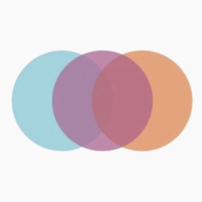

# Self Improvement Project

*"It might be exactly what you need to hear today"* - Lawrence McLelland

### Contributors

### Tech Stack

- [React](https://reactjs.org)
- [Redux](https://redux.js.org)
- [Material-UI](https://mui.com)
- [Bootstrap](https://getbootstrap.com)
- [Github Pages](https://pages.github.com)

### Directories

- `docs` public facing webpage rendered by Github Pages
- `public` holds favicon & base html file
- `src` all the Typescript React code
    - `artciles` articles in Markdown
    - `components` parts of the website written in React
    - `redux` state management for handling cached data
    - `resources` images
    - `styles` css styling of html
    - `tests` tests to test the React components
    - `utils` common utility methods
